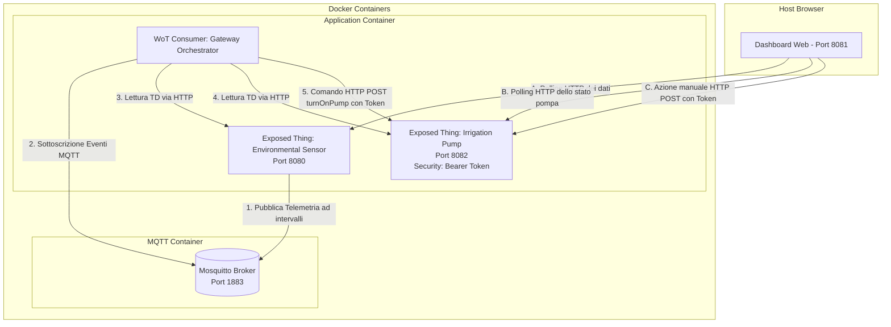

# Smart Greenhouse: Sistema di Monitoraggio ed Irrigazione Intelligente conforme al W3C Web of Things (WoT)

Questo documento descrive l'architettura, le scelte tecnologiche e i dettagli implementativi del progetto **Smart Greenhouse**, evidenziando le differenze chiave e le migliorie avanzate introdotte rispetto ad approcci didattici standard (come l'architettura basata su Express/WebSocket dei colleghi).

---

## 1. Tabella Comparativa delle Architetture

Per comprendere il valore ingegneristico di questa implementazione, la tabella seguente confronta le soluzioni tipiche (didattiche/semplificate) con il design adottato in questo progetto:

| Funzionalità / Componente | Approccio Standard (Colleghi) | Nostra Soluzione (Smart Greenhouse) | Vantaggio Ingegneristico |
| :--- | :--- | :--- | :--- |
| **Architettura di Rete** | Singolo server monolitico (Express + WebSocket + API). | **Architettura a Microservizi Distribuita** con 4 componenti separati e isolati. | Simula fedelmente dispositivi fisici indipendenti connessi in rete locale. |
| **Protocolli WoT Utilizzati** | Solo HTTP (Binding singolo). | **Sintesi Ibrida Multibinding (MQTT + HTTP)**. | Dimostra l'interoperabilità multiprotocollo nativa dello standard W3C WoT. |
| **Trasmissione Telemetria** | Polling HTTP continuo o WebSocket custom. | **Pattern Pub/Sub su MQTT** (broker-based). | Ottimizzato per dispositivi IoT reali (ridotto consumo energetico e di banda). |
| **Sicurezza degli Accessi** | Nessuna sicurezza definita nelle TD. | **Bearer Token Security** (API Key) formale. | Protegge gli attuatori da attivazioni non autorizzate in ambienti industriali. |
| **Logica di Controllo** | Soglia fissa on/off (es. irriga sempre per 30s). | **Controllo Chiuso Proporzionale** (durata dinamica in base al deficit di umidità). | Ottimizzazione del consumo idrico e prevenzione dello stress idrico delle piante. |
| **Orchestrator / Gateway** | Codice Express custom non conforme a WoT. | **WoT Consumer Gateway puro** via `@node-wot/core`. | Rispetto rigoroso degli standard; le Thing Descriptions vengono consumate a runtime. |
| **Deployment** | Esecuzione manuale da terminali multipli. | **Docker Compose Multi-Container** (MQTT Broker + App). | Installazione con un solo comando, portabilità totale ed isolamento di rete. |
| **Interfaccia Utente** | Dashboard HTML base. | **Glassmorphic UI Premium** con terminale macOS integrato e parser di sintassi TD. | UX eccezionale e visualizzazione immediata della conformità semantica delle Thing. |

---

## 2. Architettura del Sistema

Il sistema si compone di quattro entità logiche distinte che comunicano tramite standard WoT, distribuite su container Docker:



### Componenti di Rete e Porte Dedicate
1. **MQTT Broker (`greenhouse-mqtt-broker`)** [Porta `1883`]: Broker Eclipse Mosquitto che fa da collettore dei dati inviati dai sensori.
2. **Sensor Thing (HTTP/MQTT)** [Porta `8080`]: Espone le proprietà di temperatura e umidità via HTTP ed emette periodicamente eventi di telemetria sul broker MQTT.
3. **Pump Actuator Thing (HTTP con Sicurezza)** [Porta `8082`]: Espone lo stato della pompa (`pumpStatus`) e l'azione (`turnOnPump`). È protetto da autenticazione Bearer Token.
4. **Gateway Orchestrator (WoT Consumer)**: Consuma le Thing Description del sensore e della pompa. Ascolta i dati dei sensori via MQTT ed esegue la logica proporzionale azionando la pompa via HTTP.
5. **Dashboard Web** [Porta `8081`]: Interfaccia grafica che interroga periodicamente gli endpoint HTTP esposti dai nodi WoT per aggiornare grafici, log storici e la visualizzazione del codice JSON-LD delle TD.

---

## 3. Dettagli Implementativi Unici

### A. Sintesi Multibinding (MQTT + HTTP)
A differenza di soluzioni monolitiche, il nostro **Gateway** inizializza un runtime WoT con due client factory diversi:
```typescript
import { Servient } from "@node-wot/core";
import { HttpClientFactory } from "@node-wot/binding-http";
import { MqttClientFactory } from "@node-wot/binding-mqtt";

const servient = new Servient();
servient.addClientFactory(new HttpClientFactory());
servient.addClientFactory(new MqttClientFactory());
const WoT = await servient.start();
```
Questo permette di orchestrare dispositivi fisici che parlano protocolli diversi in modo trasparente.

### B. Gestione della Sicurezza formale (W3C TD)
La Thing Description della pompa dichiara esplicitamente la sicurezza di tipo `bearer`:
```json
"securityDefinitions": {
  "api_key": {
    "scheme": "bearer",
    "in": "header",
    "name": "Authorization"
  }
}
```
L'attuatore verifica il token ad ogni chiamata. L'Orchestratore e la Dashboard iniettano le credenziali corrette a livello di binding HTTP WoT.

### C. Logica di Irrigazione Proporzionale
La durata dell'irrigazione non è statica, ma calcola la gravità del deficit idrico del suolo:
```typescript
let duration = 10;
if (humidity >= 25) {
  duration = 5;      // Umidità vicina alla soglia -> Irrigazione leggera (5s)
} else if (humidity >= 20) {
  duration = 10;     // Umidità moderata -> Irrigazione media (10s)
} else if (humidity >= 15) {
  duration = 20;     // Umidità bassa -> Irrigazione profonda (20s)
} else {
  duration = 30;     // Stato critico -> Irrigazione intensa (30s)
}
await pumpThing.invokeAction("turnOnPump", duration);
```

### D. Interfaccia Grafica di Monitoraggio (Web)
La dashboard include:
* **Trend Storici**: Un grafico Chart.js a doppia scala (Temperatura / Umidità) con sfumature di colore neon.
* **Tabelle FIFO "Ultime 5 letture"**: Per ciascun sensore, mostra i 5 dati più recenti completi di timestamp preciso in tempo reale.
* **Visualizzatore TD con Syntax Highlighting**: Evidenziazione sintattica dinamica dei tag JSON-LD e pulsante rapido per copiare la Thing Description.

---

## 4. Istruzioni per l'Avvio in Docker

Il progetto è configurato per l'esecuzione immediata tramite Docker Compose:

1. **Compilazione ed Avvio**:
   ```bash
   docker-compose build
   docker-compose up
   ```
2. **Accesso alla Dashboard**:
   Aprire nel browser: `http://localhost:8081/`
3. **Modifica Frequenza di Campionamento**:
   Nel file `docker-compose.yml`, modificare il valore `TELEMETRY_INTERVAL` (in millisecondi) per cambiare la cadenza di invio dei sensori (es. `10000` per 10 secondi).
